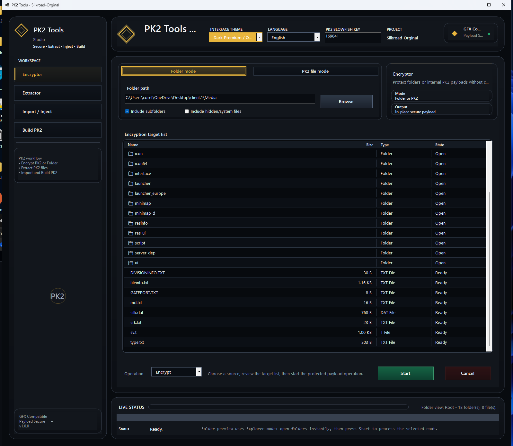
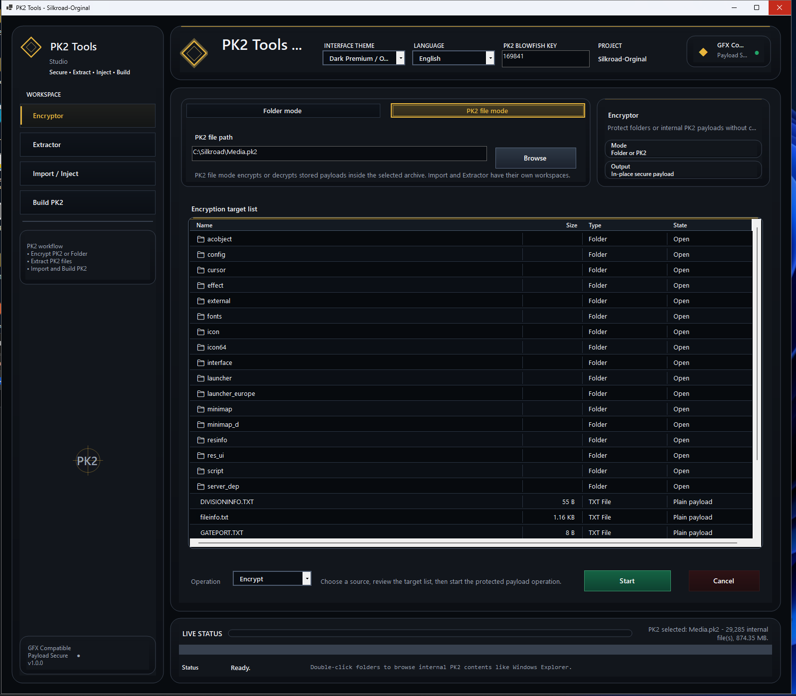
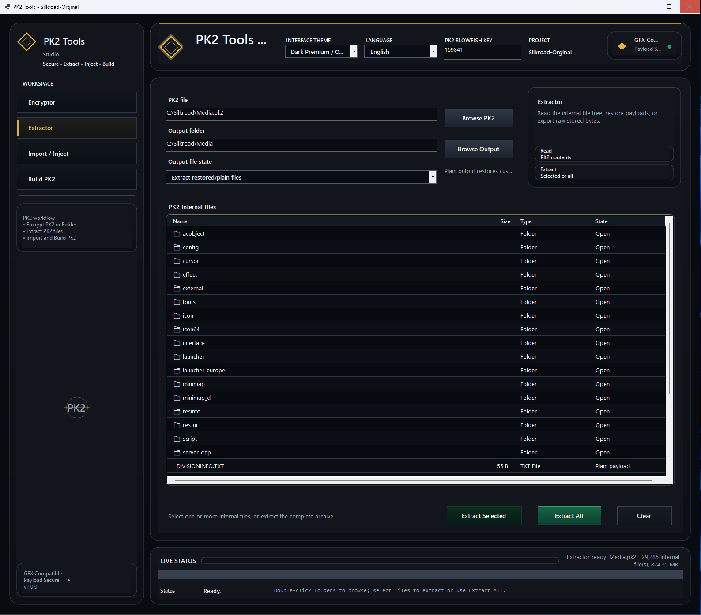
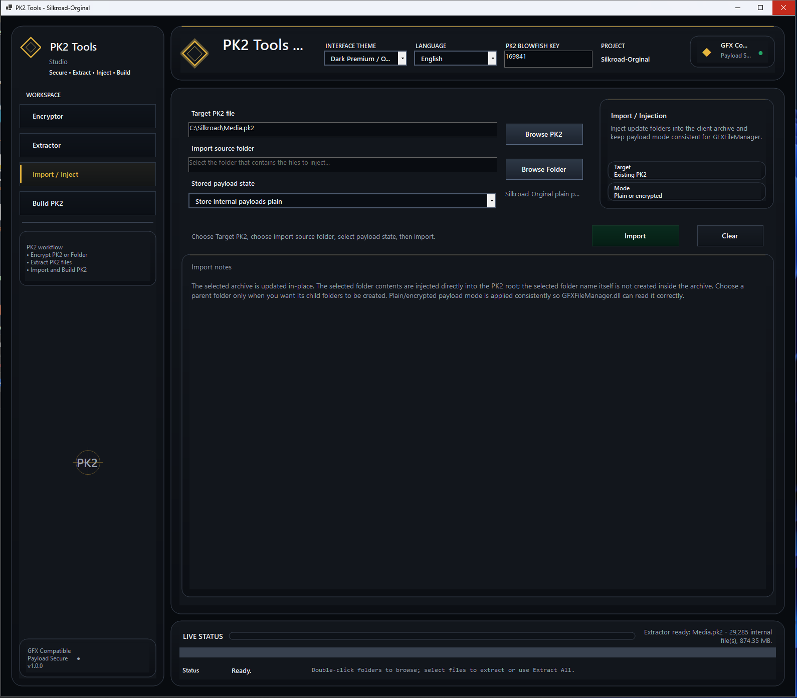
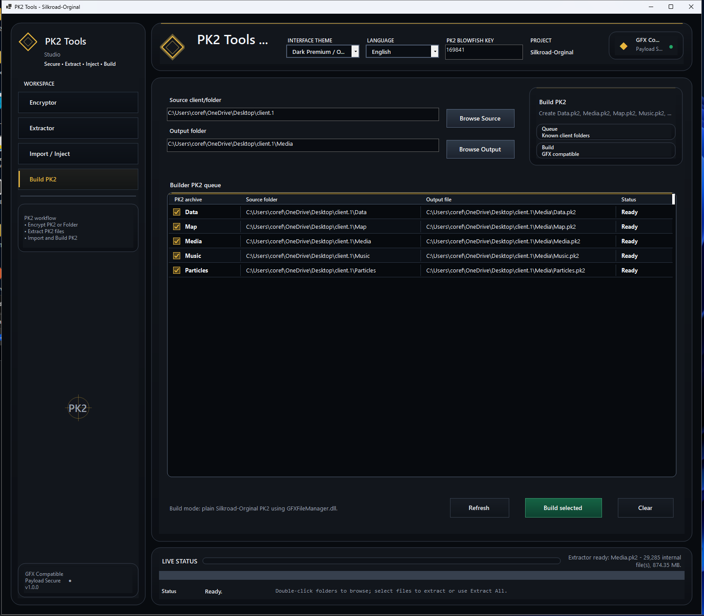

<div align="center">

# ⚜️ PK2 Tools — Silkroad-Orginal

### Build • Extract • Inject • Secure

A clean and modern Windows desktop toolkit for managing **Silkroad PK2 archives** with one focused runtime profile:  
**Silkroad-Orginal**

<br>


</div>

---

## 📌 Overview

**PK2 Tools — Silkroad-Orginal** is a Windows desktop application designed to help developers, server owners, and client editors work with Silkroad PK2 files in a clean and organized interface.

The tool includes four main workspaces:

- 🔐 **Encryptor**
- 📦 **Extractor**
- 🧩 **Import / Inject**
- 🏗️ **Build PK2**

This release keeps the project simple and focused by using only one runtime profile:


The old separated profile below was removed from the source:

---

## 🖼️ Interface Preview

### 🔐 Encryptor — Folder Mode



### 🔐 Encryptor — PK2 File Mode



### 📦 Extractor



### 🧩 Import / Inject



### 🏗️ Build PK2



---

## ✨ Features

<table>
  <tr>
    <td width="25%"><b>🔐 Encryptor</b></td>
    <td>Encrypt folders or internal PK2 payloads. Internal PK2 encryption keeps Media\type.txt plain/readable by design.</td>
  </tr>
  <tr>
    <td><b>📦 Extractor</b></td>
    <td>Open PK2 archives, browse internal files, and extract selected files or full archives.</td>
  </tr>
  <tr>
    <td><b>🧩 Import / Inject</b></td>
    <td>Inject updated folders into an existing PK2 archive while keeping payload mode consistent and preserving Media\type.txt as plain data.</td>
  </tr>
  <tr>
    <td><b>🏗️ Build PK2</b></td>
    <td>Build common Silkroad PK2 archives from known client folders and optionally encrypt directory entries/internal payloads from the Builder page.</td>
  </tr>
</table>

---

## 🔐 Payload encryption rule

When internal PK2 payload encryption is enabled, the tool encrypts every file payload except:

```text
Media\type.txt
```

When building or editing `Media.pk2`, this same file can appear internally as `type.txt`; it is still kept plain. That file is always stored/read as plain data so the client can access it normally, while the rest of the PK2 payloads stay protected for GFXFileManager runtime reading.

---

## 🧱 Project Structure

The main Visual Studio solution:

```text
PK2 Tools.sln
```

Main projects:

```text
PK2 Tools
GFXFileManager
PK2Encryptor
```

Recommended runtime folder:

```text
Silkroad-Orginal
```

---

## 🧰 Requirements

Before building the project, install:

- Windows 10 / Windows 11
- Visual Studio 2022 or newer
- .NET Desktop Development workload
- Desktop development with C++ workload
- MSBuild
- C++ build tools for `GFXFileManager`

---

## 🚀 Build Instructions

1. Clone the repository:

```bash
git clone https://github.com/TheRock2007/PK2-Tools-Silkroad-Orginal.git
```

2. Open the solution:

```text
PK2 Tools.sln
```

3. Select build configuration:

```text
Release
```

or

```text
Debug
```

4. Build the full solution from Visual Studio.

5. Run the main desktop application.

---

## 🗂️ Main Workflow

```text
1. Select workspace
2. Choose PK2 file or source folder
3. Set PK2 Blowfish Key if needed
4. Preview or load files
5. Run selected operation
```

---

## 📚 Workspace Details

### 🔐 Encryptor

The Encryptor workspace supports two modes:

```text
Folder mode
PK2 file mode
```

Use it to process a folder or a selected PK2 file with the configured Blowfish Key.

---

### 📦 Extractor

The Extractor workspace can:

- Load PK2 archives
- Browse internal PK2 structure
- Extract selected files
- Extract all files
- Restore plain payloads when needed

---

### 🧩 Import / Inject

The Import / Inject workspace can:

- Select a target PK2 archive
- Select an import source folder
- Inject files into the PK2 root
- Update existing internal files
- Keep payload mode compatible with `GFXFileManager`

---

### 🏗️ Build PK2

The Build PK2 workspace supports building known Silkroad client archives:

```text
Data.pk2
Map.pk2
Media.pk2
Music.pk2
Particles.pk2
```

---

## 🎨 Theme

The interface uses a dark premium theme with gold accents, designed for a clean studio-style workflow.

---

## 🏷️ Recommended GitHub Settings

Recommended repository name:

```text
PK2-Tools-Silkroad-Orginal
```

Recommended repository description:

```text
PK2 Tools for Silkroad-Orginal: Encryptor, Extractor, Import/Inject, and PK2 Builder with editable Blowfish Key support.
```

Recommended visibility:

```text
Public
```

Recommended `.gitignore`:

```text
VisualStudio
```

Recommended license:

```text
MIT License
```

---

## 📄 License

This project is released under the **MIT License**.

You are allowed to use, modify, and distribute the source code while keeping the license notice.

---

## ⚠️ Notice

This project is intended for development, education, archive management, and Silkroad client maintenance.

Use it only with files and projects you are allowed to modify.

---

<div align="center">

### ⚜️ PK2 Tools — Silkroad-Orginal

Made for clean Silkroad PK2 archive management.

</div>
